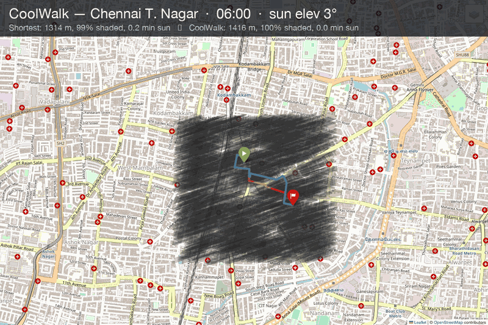
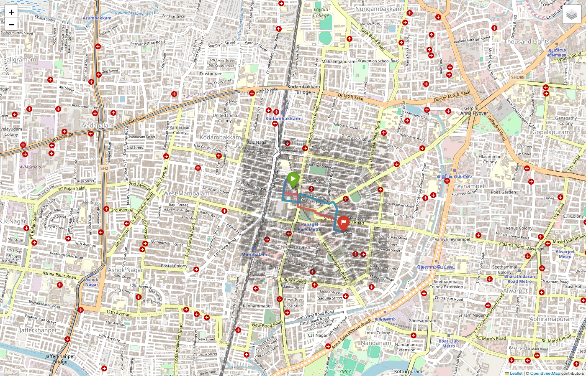
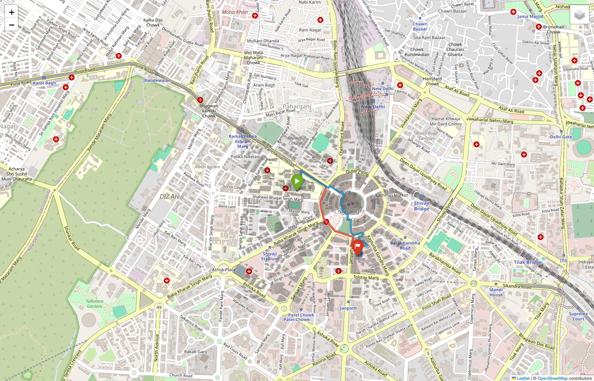
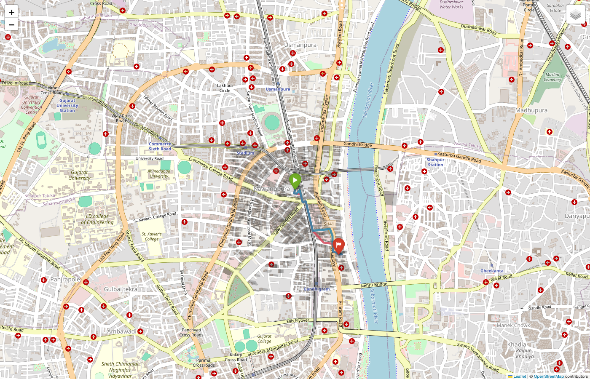
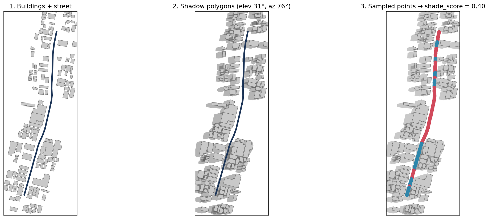
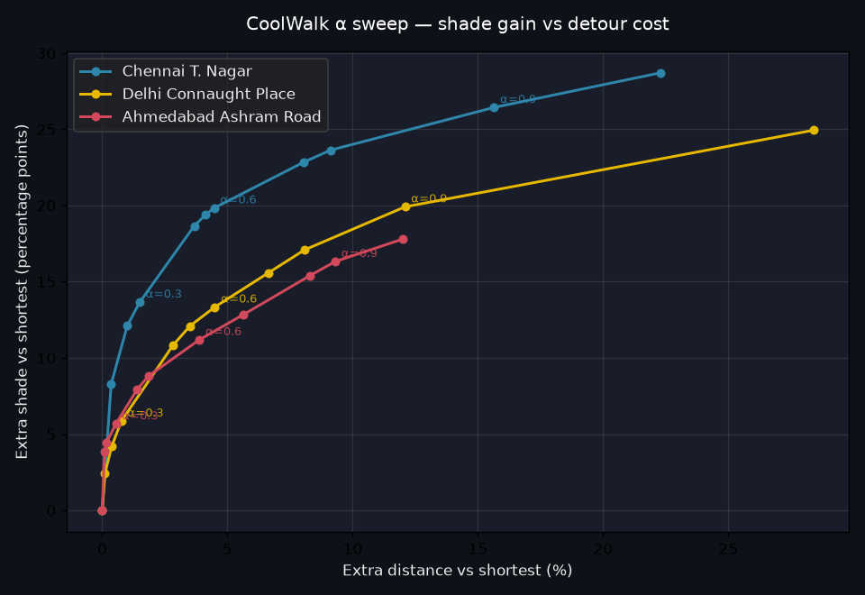

# ShadowWalk 🌤️

**Find the shadiest walking path between two points — not the shortest.**


> **Live demo:** _(coming soon — Streamlit Community Cloud link goes here)_



*Chennai T. Nagar, one May day. Grey polygons are building shadows at each hour. Red = fastest route, blue = ShadowWalk. Watch the blue route hug the shady side of the street in the morning, collapse onto the red at solar noon (nothing to route around), then swing back out again in the afternoon.*

ShadowWalk is a shade-aware pedestrian router. It pulls a city's walking network and building footprints from OpenStreetMap, computes the sun's position for a given hour, casts building shadows onto the ground, and then runs a weighted Dijkstra that discounts sunlit streets. The result: routes that stay in the shade at the cost of a small detour.

Built with Chennai, Delhi and Ahmedabad in mind — Indian cities where afternoon walking kills people every summer.

---

## Why this exists

- Google Maps has never optimised a walking route for thermal comfort. It optimises for **distance**, occasionally for elevation. Never for whether you'll be cooked alive on the way.
- In the sun vs in a building's shadow at 2 PM in Ahmedabad or Phoenix is a **15–20 °C surface-temperature swing**.
- Heat-related deaths in Ahmedabad, Delhi, Chennai, Karachi, and Phoenix rise every year. The victims are almost always outdoor walkers — gig workers, the elderly, school kids, tourists.
- Existing "cool walk" pilots (Los Angeles Cool Streets, Barcelona thermal maps) are one-off government studies, not tools an ordinary person can open on their phone.

ShadowWalk is a working prototype of that missing tool, built on 100 % free data and libraries.

---

## What it does

1. Downloads OSM walking network + building footprints for a city (cached to disk on first run).
2. Fetches the current sun azimuth & elevation from `pvlib` for the requested date/time.
3. For each building, translates its footprint in the direction away from the sun by `height / tan(elevation)` metres, unions with the original, takes the convex hull — that's the building's 2-D ground shadow.
4. For each street edge, samples points every 5 m and counts how many fall inside any shadow polygon. That fraction is the edge's `shade_score`.
5. Runs Dijkstra with weight `length × (1 − α × shade_score)`. `α = 0` gives the fastest route; `α = 1` maximises shade regardless of detour.
6. Optionally pulls temperature, UV, and shortwave-radiation from Open-Meteo to convert "sun-exposure minutes" into a subjective "felt heat load".

---

## Results — Indian cities, May morning

Three heroes generated by [`scripts/generate_hero.py`](scripts/generate_hero.py) — open the HTMLs to pan / zoom the interactive maps.

| City                          | Time  | Distance         | Shortest shaded | ShadowWalk shaded | Sun exposure saved |
|-------------------------------|-------|------------------|-----------------|-----------------|--------------------|
| **Chennai** — T. Nagar        | 08:00 | 1.31 → 1.51 km   | 33 %            | **68 %**        | **4.9 min**        |
| **Delhi** — Connaught Place   | 09:00 | 1.63 → 1.87 km   | 8 %             | **46 %**        | **6.1 min**        |
| **Ahmedabad** — Ashram Road   | 17:00 | 1.08 → 1.17 km   | 11 %            | **35 %**        | **2.6 min**        |

| Chennai | Delhi | Ahmedabad |
|---------|-------|-----------|
|  |  |  |

Interactive HTMLs (open in a browser to pan/zoom, hover routes for tooltips):
[`chennai`](results/hero_chennai_8am.html) · [`delhi`](results/hero_delhi_9am.html) · [`ahmedabad`](results/hero_ahmedabad_5pm.html)

### Random-O/D benchmark

Averages over 20 random origin-destination pairs per city at α = 0.9 ([`scripts/alpha_sweep.py`](scripts/alpha_sweep.py)):

| Scenario                        | Mean detour | Mean extra shade | Mean sun saved |
|---------------------------------|------------:|-----------------:|---------------:|
| Chennai T. Nagar, 08:00         |     +15.6 % |         +26.4 pp |        3.7 min |
| Delhi Connaught Place, 09:00    |     +11.9 % |         +19.7 pp |        1.7 min |
| Ahmedabad Ashram Road, 17:00    |      +9.3 % |         +16.3 pp |        1.4 min |

Full 5-scenario × 3-α × 15-pair breakdown in [`scripts/backtest.py`](scripts/backtest.py).

---

## Quick start

```bash
git clone <this-repo> shadowwalk
cd shadowwalk

python -m venv .venv && source .venv/bin/activate
pip install -r requirements.txt

# Launch the Streamlit UI: pick a city, click two points, watch the routes appear
streamlit run app/streamlit_app.py
```

First city load takes 30–120 s (OSM download); subsequent loads are instant from the disk cache in `data/`.

---

## The UI

- **City dropdown** — Chennai, Delhi, Ahmedabad (add more in [`src/config.py`](src/config.py))
- **Hour-of-day slider** — drag from dawn to dusk and watch the routes morph as the sun moves
- **α (shade preference)** — 0 = fastest, 1 = shadiest
- **Include tree cover** — folds OSM trees + parks into the shade layer
- **Overlay shadow polygons** — translucent grey overlay so you see *why* one route beats the other
- **Weather-adjusted "felt exposure"** — Open-Meteo temperature × UV × radiation → subjective heat-load minutes

---

## Repo layout

```
src/
  config.py          # cities, defaults, cache paths
  data_loader.py     # OSM download + disk cache + Overpass mirror fallback
  sun.py             # pvlib wrapper (azimuth, elevation)
  shade.py           # shadow-polygon shade scoring (STRtree-indexed)
  trees.py           # OSM tree + park layer
  weather.py         # Open-Meteo integration
  ms_footprints.py   # Microsoft Global Building Footprints (quadkeys)
  routing.py         # weighted Dijkstra with metric-CRS nearest-node
  metrics.py         # distance, shaded %, sun-exposure & felt-heat minutes
  viz.py             # folium dual-route map + shadow overlay
app/streamlit_app.py # web UI
scripts/
  backtest.py        # 5-scenario × 3-α × 15-pair benchmark
  generate_hero.py   # produce the three hero HTMLs
tests/               # 21 unit tests
results/             # hero HTMLs + backtest artefacts
```

---

## How the shade score works



*Left → right: building footprints + one street segment · shadow polygons cast at 8 AM Chennai · sampled points along the street, blue = shaded, red = sun-exposed. Reproducible via `notebooks/03_shade_algorithm.ipynb`.*

For each building:

```
shadow_length = height / tan(sun_elevation)
shadow_direction = 180° - sun_azimuth   # opposite the sun
shifted_footprint = translate(footprint, by shadow_length in that direction)
shadow_polygon = convex_hull(footprint ∪ shifted_footprint).buffer(0.5m)
```

All shadow polygons + tree canopies get indexed in an STRtree. For each edge, we sample points every 5 m and ask the index: is this point inside any shadow? The score is the shaded fraction.

Then the router weights each edge as `length × (1 − α × shade_score)`. Because shade is stored as a per-edge attribute, changing α is instant — no recomputation needed. Recomputing shade for a new hour is a 1–5 s operation for a 1 km² neighbourhood on an M3 Mac.

---

## Trade-off curve



For each city we run 20 random O/D pairs and sweep α from 0 (shortest) to 1 (shadiest). The x-axis is how much longer the route becomes; the y-axis is how many more percentage-points of shade you get. Regenerate with `python scripts/alpha_sweep.py`.

Chennai gets the strongest lift — dense low-rise streets stack shadows well at low sun angles. Delhi is close behind. Ahmedabad's Ashram Road curve is flatter — a real fix would need LiDAR or more OSM building-height contributions.

---

## Costs & data sources

Everything is $0.

| Layer                 | Source                                       |
|-----------------------|----------------------------------------------|
| Streets + buildings   | OpenStreetMap (via `osmnx`)                  |
| Building heights      | OSM `height` → `building:levels × 3 m` → type-based defaults ([`_estimate_height`](src/data_loader.py)) |
| Trees + parks         | OSM `natural=tree`, `landuse=forest`, `leisure=park` |
| Sun position          | `pvlib.solarposition`                        |
| Weather               | Open-Meteo (no API key required)             |
| Optional heights      | Microsoft Global ML Building Footprints (patchy coverage — no heights for India, no coverage for USA cities; parser present, activate with `use_ms_footprints=True`) |
| Hosting               | Streamlit Community Cloud (free tier)        |

Explicitly avoided: Google Maps API, Mapbox, any commercial elevation/satellite feed.

---

## Tests

```bash
pytest -q
```

21 tests across sun, shade (shadow-polygon geometry, night, tree cover), routing (α extremes, MultiDiGraph weight-fn handling), weather (heat-multiplier baseline, offline fallback, hour picking), MS footprints (quadkey math, height merge).

---

## Known limitations

- OSM building-height coverage is patchy outside Europe. The 4-tier fallback (`_estimate_height`) helps but nothing beats real heights. Microsoft Global Footprints have heights for parts of Africa and SE Asia but not India or the US. LiDAR would be the real fix.
- The shadow polygons treat each building independently; overlapping shadows are handled correctly by the union, but there's no reflected-radiation model, no partial-shade gradient, and the sample-then-test approach can undercount edges shorter than 5 m.
- Trees are modelled as flat canopy polygons — no tree height, no seasonal defoliation. Deciduous trees in winter would fool the model.
- Streamlit Community Cloud has a 1 GB RAM ceiling; the disk cache is deliberately per-neighbourhood rather than per-city.

---

## License

MIT.
